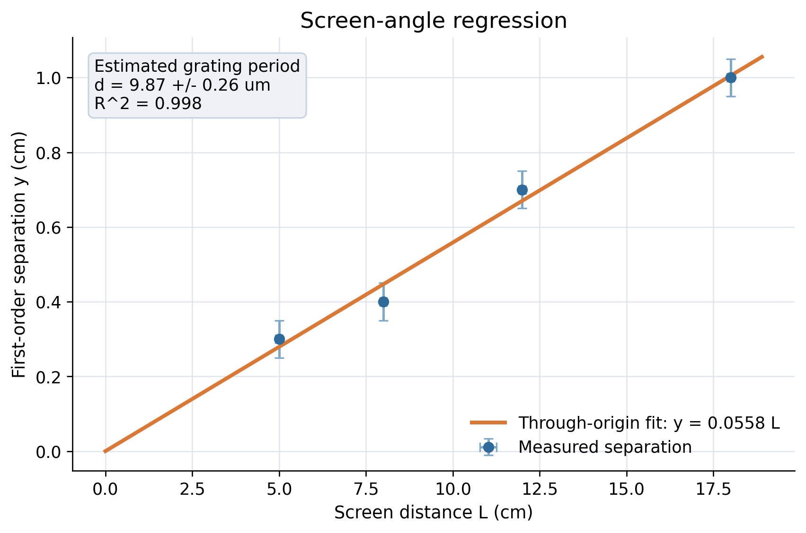
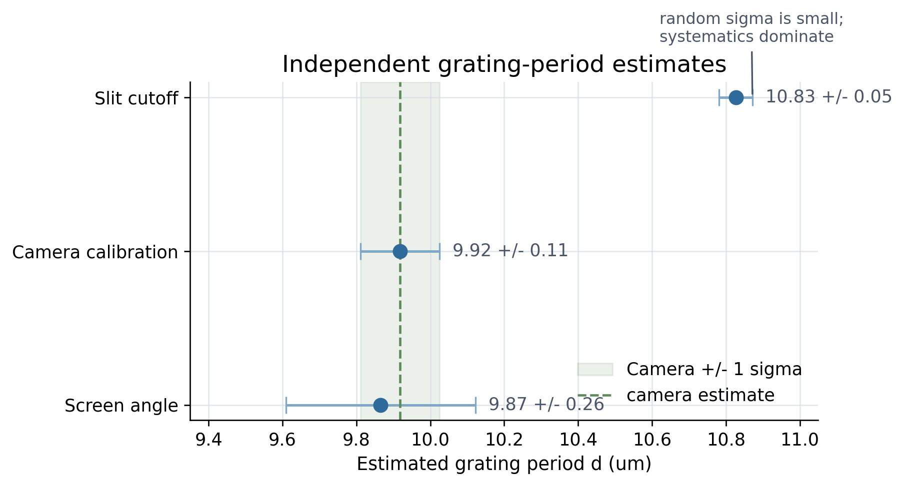

# Fourier Optics Lab (4f microscope): data analysis + uncertainty propagation

This repository turns a 4f microscope lab into a reproducible Python analysis project. Starting from raw CSV measurements, it reproduces the report numbers, propagates uncertainties analytically, exports machine-readable results, and generates figures that GitHub can render directly.

## Research Portfolio Signal

This project is a compact example of reproducible model comparison. It evaluates three
measurement routes, carries uncertainty through each chain, exports structured outputs,
and makes the figures inspectable without opening the report. That structure is useful
beyond physics: it is the same pattern I use for comparing model outputs, scoring
rules, and measurement definitions in AI-assisted research.

## Reviewer Quick Scan

- **Data workflow:** raw measurement tables are converted into processed CSV/JSON
  outputs, figures, and a report-facing notebook.
- **Methods signal:** constrained regression, method comparison, analytic uncertainty
  propagation, and systematic-vs-random error discussion.
- **Reproducibility signal:** the analysis can be rerun from a single script or Makefile
  target and produces GitHub-renderable artifacts.
- **Transferable skill:** the project shows how I compare alternative measurement
  definitions, which maps naturally to benchmark scoring and model-evaluation design.

## What this repo shows

- Data analysis in `numpy`, `pandas`, and `matplotlib`
- Constrained regression for the screen-angle method
- Analytic uncertainty propagation across multiple measurement chains
- Comparison of independent experimental methods, not just a single final number
- Reproducible outputs in notebook, CSV, JSON, and PDF form

## Scientific question

How consistent are three independent estimates of the grating period in a Fourier optics lab, and which method is most defensible once random and systematic uncertainty are separated?

## Key results

| Measurement route | Result for grating period d (um) | Main idea | Interpretation |
| --- | ---: | --- | --- |
| Screen-angle geometry | 9.87 +/- 0.26 | Through-origin regression of diffraction spacing vs screen distance | Good consistency, but largest random uncertainty |
| Camera calibration | 9.92 +/- 0.11 | Calibrated object-plane pixel scale and period counting | Best overall method in this dataset |
| Fourier-plane slit cutoff | 10.83 +/- 0.05 | Spatial-frequency cutoff inferred from slit width | Reported sigma is random-only; systematics dominate |

Additional quantitative result:

- Abbe-limit estimate: `dx_min ~= 3.96 um`, consistent with resolving the `6 um` feature more clearly than the `4 um` feature.

## Analysis outputs

The repository is set up so a reviewer can see the core analysis without opening the PDF first.

**Screen-angle regression**



**Method comparison with propagated uncertainties**



## Uncertainty propagation strategy

The Python workflow does more than fit a line. It carries uncertainty through each calculation chain.

For the screen-angle method:

```text
y = mL
theta = arctan(m)
d = lambda / sin(theta)
sigma_theta = sigma_m / (1 + m^2)
sigma_d = |dd/dtheta| sigma_theta
```

For the camera method, the script propagates uncertainty from calibration pixels to object-plane scale and then into the final period estimate. For the slit-cutoff method, it reports the random component directly and also computes a simple systematic cross-check against the camera-based estimate.

## Reproduce the analysis

```bash
python -m venv .venv
pip install -r analysis/requirements.txt
python analysis/analyze.py
```

Main outputs:

- `analysis/FourierOptics_Analysis.ipynb`: executed notebook rendered by GitHub
- `data/processed/results.json`: structured summary for all experiments
- `data/processed/grating_results.csv`: compact comparison table
- `analysis/output/*.png`: regression, residual, and uncertainty figures
- `report/main.pdf`: polished lab report with derivations and discussion

## Repository structure

```text
analysis/        Python scripts, notebook, and generated figures
data/raw/        Raw measurements with assigned uncertainties
data/processed/  Machine-readable outputs generated by the analysis
report/          LaTeX source and compiled PDF report
docs/            Supporting notes
```
